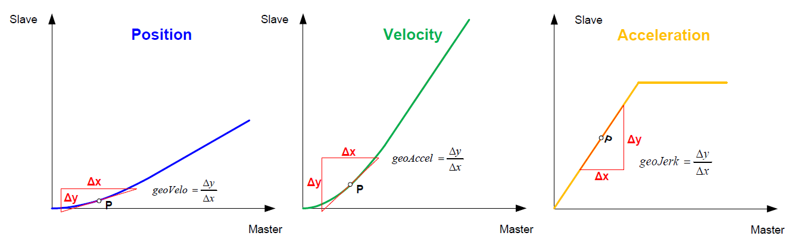
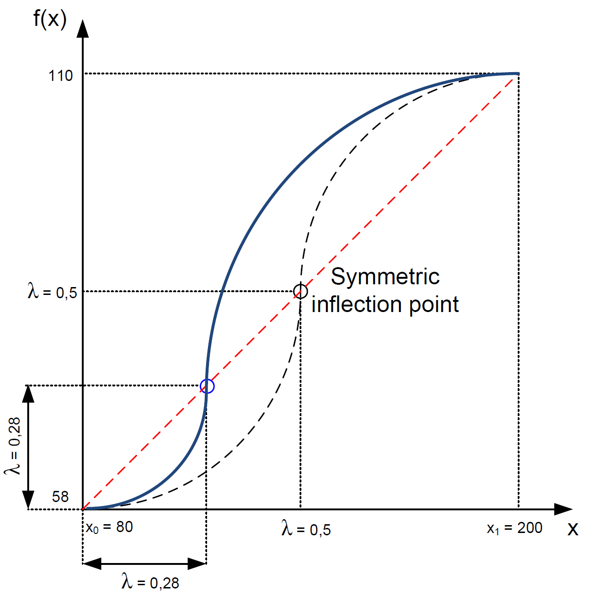

# Explanations of the Different Profile Types

For the different profile types only certain boundary conditions are supported. All other parameters are not taken into account.

## Derivations in the boundary points

The derivations have to be parameterized with real values, the standardization described in the laws of motion according to VDI 2143 does not have to be taken into account by the user.

## Inflection point

- Symmetric laws of motion are characterized by an inflection point at λ = 0.5 within the leading range (x₀-x₁).
- Asymmetric laws of motion are created by displacing the inflection point, e.g. by shifting on the strigt line with the function $f(x) = \frac{\Delta y}{\Delta x} x$

Resulting from this, there are different maximum acceleration values Ca in the first part of the profile and Ca* in the second.
Furthermore the point of the maximum velocity displaces in the same way as the inflection point in this profile.
For the new ranges 0 $\le$ x $\leq$ and λ $\leq$ x $\leq$ 1 there are enlarged and reduced parts of symmetric laws of motion applied.

## Characteristic Values

- **Cv = Cmstat**: maximum value of velocity (= static torque characteristic)
- **Ca**: maximum value of acceleration (first half of profile, if asymmetrical)
- **Ca***: maximum value of acceleration (second half of profile, if asymmetrical)
- **Cj**: maximum value of jerk
- **Cmdyn**: dynamic torque characteristic

## List of profile types

This table provides a comprehensive overview of all available profile types in the LCamHdl library, their general information, and supported boundary condition parameters.

| Profile Type | General Information | Supported Boundary Condition Parameters |
|---|---|---|
| **EMPTY (default):**   `LCAMHDL_PROFILE_EMPTY` | **Application:**   Empty element – not used in current cam    **Number of required TO cam segments:**   0 | - |
| **POINT:**   `LCAMHDL_PROFILE_POINT` | **Application:**   Definition of a point with undefined dynamics    **Number of required TO cam points:**   1 | - `leadingValueStart`   - `followingValueStart` |
| **DWELL:**   `LCAMHDL_PROFILE_DWELL` | **Application:**   Standstill    **Number of required TO cam segments:**   1    **Requirement:**   `leadingValueStart < leadingValueEnd` | - `leadingValueStart`   - `followingValueStart`   - `leadingValueEnd`   - `followingValueEnd` |
| **CONST_VELO:**   Straight line   `LCAMHDL_PROFILE_CONST_VELO` | **Application:**   Constant velocity    **Number of required TO cam segments:**   1    **Disadvantages:**   Motion with impacts, vibrations, noise, wear    **Requirement:**   `leadingValueStart < leadingValueEnd` | - `leadingValueStart`   - `followingValueStart`   - `leadingValueEnd`   - `followingValueEnd` |
| **POLY_3:**   3rd degree polynomial   `LCAMHDL_PROFILE_POLY_3` | **Application:**   Transition at continuous velocity    **Number of required TO cam segments:**   λ = 0.5: 1   λ <> 0.5: 2    **Addition:**   Displacement of the inflection point (λ)   λ = 0.5: The position of the inflection point is calculated automatically. An inflection point at λ = 0.5 can be "enforced" by using POLY_4.   λ <> 0.5: Two 3rd degree polynomial segments are created. This leads to a discontinuity in jerk within the profile. Recommendation: Use POLY_4 instead.    **Advantages:**   Can be used for many motion tasks – presetting of position and velocity    **Disadvantages:**   Overshoot possible    **Requirement:**   `leadingValueStart < leadingValueEnd` | - `leadingValueStart`   - `followingValueStart`   - `leadingValueEnd`   - `followingValueEnd`   - `geoVeloStart`   - `geoVeloEnd`    **Addition:**   `0 < λ < 1`   λ: `inflectionPointParameter` |
| **POLY_4**   4th degree polynomial   `LCAMHDL_PROFILE_POLY_4` | **Application:**   Transition at continuous velocity.    **Number of required TO cam segments:**   1    **Addition:**   Displacement of the inflection point (λ)   Recommendation: Use POLY_3 with λ = 0.5 for automatic calculation of the inflection point.    **Advantages:**   Can be used for many motion tasks – presetting of position and velocity    **Disadvantages:**   Overshoot possible    **Requirement:**   `leadingValueStart < leadingValueEnd` | - `leadingValueStart`   - `followingValueStart`   - `leadingValueEnd`   - `followingValueEnd`   - `geoVeloStart`   - `geoVeloEnd`    **Addition:**   `-∞ < λ < ∞`   λ: `inflectionPointParameter` |
| **POLY_5:**   5th degree polynomial   `LCAMHDL_PROFILE_POLY_5` | **Application:**   Continuous transition of velocity and acceleration    **Number of required TO cam segments:**   λ = 0.5: 1   λ <> 0.5: 2    **Addition:**   Displacement of the inflection point (λ)   λ = 0.5: The position of the inflection point is calculated automatically. An inflection point at λ = 0.5 can be "enforced" by using POLY_6.   λ <> 0.5: Two 4th degree polynomial segments are created. This leads to a discontinuity in jerk within the profile. Recommendation: Use POLY_6 instead.    **Advantages:**   Can be used for nearly all motion tasks – presetting of position, velocity and acceleration    **Disadvantages:**   Overshoot possible    **Requirement:**   `leadingValueStart < leadingValueEnd` | - `leadingValueStart`   - `followingValueStart`   - `leadingValueEnd`   - `followingValueEnd`   - `geoVeloStart`   - `geoVeloEnd`   - `geoAccelStart`   - `geoAccelEnd`    **Addition:**   `0 < λ < 1`   λ: `inflectionPointParameter` |
| **POLY_6**   6th degree polynomial   `LCAMHDL_PROFILE_POLY_6` | **Application:**   Continuous transition of velocity and acceleration    **Number of required TO cam segments:**   1    **Addition:**   Displacement of the inflection point (λ)   Recommendation: Use POLY_5 with λ = 0.5 for automatic calculation of the inflection point.    **Advantages:**   Can be used for nearly all motion tasks – presetting of position, velocity and acceleration    **Disadvantages:**   Overshoot possible    **Requirement:**   `leadingValueStart < leadingValueEnd` | - `leadingValueStart`   - `followingValueStart`   - `leadingValueEnd`   - `followingValueEnd`   - `geoVeloStart`   - `geoVeloEnd`   - `geoAccelStart`   - `geoAccelEnd`    **Addition:**   `-∞ < λ < ∞`   λ: `inflectionPointParameter` |
| **POLY_7:**   7th degree polynomial   `LCAMHDL_PROFILE_POLY_7` | **Application:**   Continuous transition of velocity, acceleration and jerk    **Number of required TO cam segments:**   2    **Addition:**   Displacement of the inflection point (λ)    **Advantages:**   Can be used for nearly all motion tasks – presetting of position, velocity, acceleration and jerk    **Disadvantages:**   Overshoot possible    The 7th degree polynomial is implemented internally by using two 6th degree polynomials.    **Requirement:**   `leadingValueStart < leadingValueEnd` | - `leadingValueStart`   - `followingValueStart`   - `leadingValueEnd`   - `followingValueEnd`   - `geoVeloStart`   - `geoVeloEnd`   - `geoAccelStart`   - `geoAccelEnd`   - `geoJerkStart`   - `geoJerkEnd`    **Addition:**   `0 < λ < 1`   λ: `inflectionPointParameter` |
| **PARABOLA:**   `LCAMHDL_PROFILE_D_D_PARABOLA`   `LCAMHDL_PROFILE_C_C_PARABOLA` | **Application:**   dwell - dwell   constant velocity - constant velocity    **Number of required TO cam segments:**   2    **Addition:**   Displacement of the inflection point (λ)    **Advantages:**   Lowest Ca value for this kind of motion transitions    **Disadvantages:**   Vibration, noise and wear due to acceleration jumps    **Requirement:**   `leadingValueStart < leadingValueEnd` | - `leadingValueStart`   - `followingValueStart`   - `leadingValueEnd`   - `followingValueEnd`   - `geoVeloStart`   - `geoVeloEnd`    **Addition:**   `0 < λ < 1`   λ: `inflectionPointParameter` |
| **BASIC_SINE:**   Basic sine oscillation   `LCAMHDL_PROFILE_D_D_BASIC_SINE`   `LCAMHDL_PROFILE_R_R_BASIC_SINE` | **Application:**   dwell - dwell   reversal - reversal    **Number of required TO cam segments:**   2    **Addition:**   Displacement of the inflection point (λ)    **Advantages:**   Low Cv-value for this kind of transitions   Low Ca-value for this kind of transitions    **Disadvantages:**   Acceleration jumps, vibrations, noise and wear    **Requirement:**   `leadingValueStart < leadingValueEnd`   `followingValueStart <> followingValueEnd` | - `leadingValueStart`   - `followingValueStart`   - `leadingValueEnd`   - `followingValueEnd`    **Addition:**   `0 < λ < 1`   λ: `inflectionPointParameter` |
| **MOD_VELO_TRAPEZOID:**   Sine-straight line-combination   `LCAMHDL_PROFILE_R_R_MOD_VELO_TRAPEZOID` | **Application:**   reversal - reversal    Content of sine in profile: `0 < c <= 1`   c: `modVeloTrapezoidParameter`    Example:   c = 0,3   30% sine (split up among start and ending)   70% straight line   λ = 0,4 → displacement towards starting point    **Number of required TO cam segments:**   c = 1: 2   c <> 1: 3    **Addition:**   1. Displacement of the inflection point (λ)   2. If λ = -1, parameterization of starting and ending acceleration necessary for calculation of λ and c    **Advantage:**   Especially low Cv-value for this kind of transitions    **Disadvantage:**   Ca-value is higher compared to basic sine    **Requirement:**   `leadingValueStart < leadingValueEnd`   `followingValueStart <> followingValueEnd` | - `leadingValueStart`   - `followingValueStart`   - `leadingValueEnd`   - `followingValueEnd`    **Addition:**   1. `0 < λ < 1`   λ: `inflectionPointParameter`    2. λ = -1   `inflectionPointParameter = -1`   `geoAccelStart <> 0`   `geoAccelEnd <> 0` |
| **INCLINED_SINE:**   Inclined sine   `LCAMHDL_PROFILE_D_D_INCLINED_SINE` | **Application:**   dwell - dwell    **Number of required TO cam segments:**   2    **Addition:**   Displacement of the inflection point (λ)    **Advantage:**   Extra low Cj-value, low vibration, well adapted for high speed    **Disadvantage:**   Cv, Ca, Cmdyn values greater than in POLY_5    **Requirement:**   `leadingValueStart < leadingValueEnd` | - `leadingValueStart`   - `followingValueStart`   - `leadingValueEnd`   - `followingValueEnd`   - `geoVeloStart = 0`   - `geoVeloEnd = 0`    **Addition:**   `0 < λ < 1`   λ: `inflectionPointParameter` |
| **MOD_ACCEL_TRAPEZOID:**   Modified acceleration trapezoid   `LCAMHDL_PROFILE_D_D_MOD_ACCEL_TRAPEZOID`   `LCAMHDL_PROFILE_D_R_MOD_ACCEL_TRAPEZOID`   `LCAMHDL_PROFILE_R_D_MOD_ACCEL_TRAPEZOID` | **Application:**   dwell - dwell   dwell - reversal   reversal - dwell    **Number of required TO cam segments:**   dwell - dwell: 6   dwell - reversal / reversal - dwell: 5    **Addition:**   dwell - dwell: Displacement of the inflection point (λ)   dwell - reversal / reversal - dwell:   1. Displacement of the inflection point (λ)   2. If λ = -1, parameterization of starting or ending acceleration necessary for calculation of λ    **Advantage:**   Extra low Ca-value for this kind of transitions    **Disadvantage:**   Cv, Cj and Cmdyn values are higher compared to harmonic combination    **Requirement:**   `leadingValueStart < leadingValueEnd` | - `leadingValueStart`   - `followingValueStart`   - `leadingValueEnd`   - `followingValueEnd`   - `geoVeloStart = 0`   - `geoVeloEnd = 0`    **Addition:**   dwell - dwell:   `0 < λ < 1`   λ: `inflectionPointParameter`    dwell – reversal:   1. `0 < λ < 1`   λ: `inflectionPointParameter`   2. λ = -1   `inflectionPointParameter = -1`   `geoAccelEnd <> 0`    reversal – dwell:   1. `0 < λ < 1`   λ: `inflectionPointParameter`   2. λ = -1   `inflectionPointParameter = -1`   `geoAccelStart <> 0` |
| **MOD_SINE:**   Sinusoidal acceleration   `LCAMHDL_PROFILE_D_D_MOD_SINE`   `LCAMHDL_PROFILE_C_C_MOD_SINE`   `LCAMHDL_PROFILE_D_C_MOD_SINE`   `LCAMHDL_PROFILE_C_D_MOD_SINE` | **Application:**   dwell - dwell   constant velocity - constant velocity   dwell - constant velocity   constant velocity - dwell    **Number of required TO cam segments:**   4    **Addition:**   dwell - dwell: Displacement of the inflection point (λ)   All others:   1. Displacement of the inflection point (λ)   2. If λ = -1, parameterization of Ca* necessary for calculation of λ    **Advantage:**   Well adapted for high speed, low Cv, Ca and Cmdyn values    **Disadvantage:**   Cj-value is higher compared to inclined sine    **Requirement:**   `leadingValueStart < leadingValueEnd`   `followingValueStart <> followingValueEnd` | - `leadingValueStart`   - `followingValueStart`   - `leadingValueEnd`   - `followingValueEnd`   - `geoVeloStart`   - `geoVeloEnd`    dwell – dwell:   - `geoVeloStart = 0`   - `geoVeloEnd = 0`    **Addition:**   dwell - dwell:   `0 < λ < 1`   λ: `inflectionPointParameter`    All others:   1. `0 < λ < 1`   λ: `inflectionPointParameter`   2. λ = -1   `inflectionPointParameter = -1`   `modSineMaxAccelCaStar <> 0` |
| **HARMONIC_COMBINATION:**   Harmonic combination consists of harmonic parts only   `LCAMHDL_PROFILE_C_R_HARMONIC_COMBINATION`   `LCAMHDL_PROFILE_R_C_HARMONIC_COMBINATION`   `LCAMHDL_PROFILE_D_R_HARMONIC_COMBINATION`   `LCAMHDL_PROFILE_R_D_HARMONIC_COMBINATION` | **Application:**   constant velocity - reversal   reversal - constant velocity   dwell - reversal   reversal - dwell    **Number of required TO cam segments:**   3    **Addition:**   1. Displacement of the inflection point (λ)   2. If λ = -1, parameterization of starting or ending acceleration necessary for calculation of λ    **Advantage:**   Extra low Cv and Cmdyn values for this kind of transitions    **Disadvantage:**   Ca-value is higher compared to modified acceleration trapezoid    **Requirement:**   `leadingValueStart < leadingValueEnd`   `followingValueStart <> followingValueEnd` | - `leadingValueStart`   - `followingValueStart`   - `leadingValueEnd`   - `followingValueEnd`    constant velocity – reversal:   - `geoVeloStart <> 0`   - `geoVeloEnd = 0`    reversal - constant velocity:   - `geoVeloStart = 0`   - `geoVeloEnd <> 0`    **Addition:**   1. `0 < λ < 1`   λ: `inflectionPointParameter`   2. λ = -1   `inflectionPointParameter = -1`    constant velocity – reversal:   `geoAccelEnd <> 0`    reversal – constant velocity:   `geoAccelStart <> 0`    dwell - reversal:   `geoAccelEnd <> 0`    reversal - dwell:   `geoAccelStart <> 0` |
