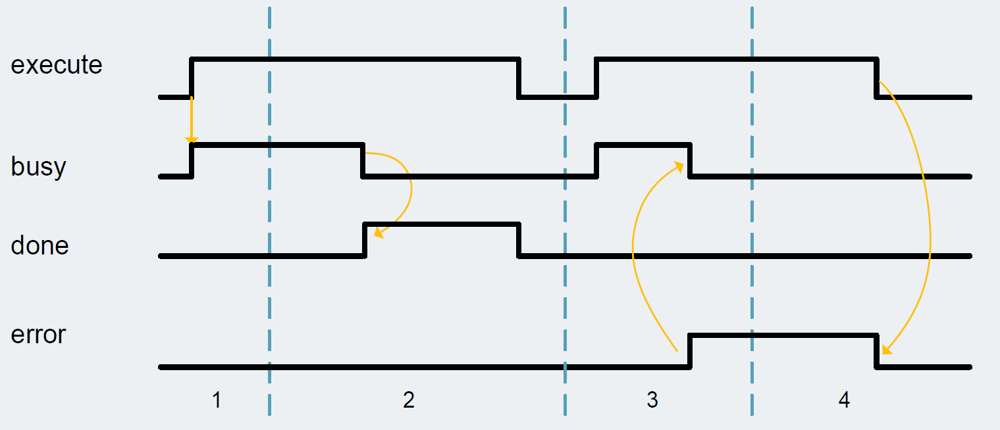

## Function Characteristics

1. The function block is activated by setting the execute input.
The processing of the FB is indicated with busy = TRUE and done = FALSE.

2. If busy is FALSE and done is TRUE the function block finished processing. The
cam disk is interpolated – a later addition of points / segments requires a new
interpolation of the technology object cam.

3. If an error occurs during processing (e.g. error when executing the function
block, internal errors of system functions, parameter supply error etc.), the
error output is set and the corresponding error ID is written to the output status.
Additional error information is provided at the output diagnostics.

4. All errors will be acknowledged and error output is reset if the execute input is
reset. Signals stay active for at least one cycle. Reset of the diagnostic
information is done with the next rising edge of execute.

